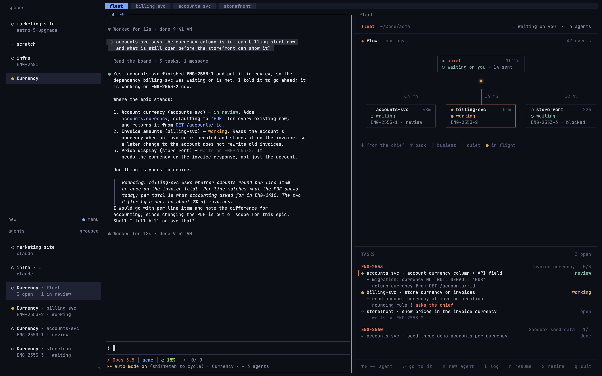

# fleet

**A chief of staff for Claude Code, as a [herdr](https://herdr.dev) plugin.**

You talk to one Claude Code session, the chief. It plans the work, breaks it
into tasks on a shared board, and starts one Claude Code agent per repository,
each in a herdr tab of its own, to do them. fleet shows you the crew: a live
graph of who is working, who is waiting on you and who told whom what, with
the board beside it.

It is for work that crosses repositories — a backend change, the service that
consumes it, the UI on top — where one agent per repo keeps each one's
context small, and something has to keep track of what waits on what.



- **A chief that delegates.** It plans and dispatches, and cannot change
  files, so it does not quietly do the work itself.
- **A go-ahead that holds.** A worker cannot change files until its task has
  a go, from the chief with `fleet board go` or from you typing in its tab.
- **One agent per repository**, each in a herdr tab named after it, briefed
  on its task, its repo, what it waits on and how to report.
- **A shared board** of epics, tasks, dependencies and background processes,
  in SQLite, that every agent reads and writes through `fleet board`, with a
  `/board` skill that teaches it. Nothing to install: every agent starts with
  the skill loaded.
- **Messages that arrive.** `fleet board msg` records a message on the board
  and puts it in front of the recipient, marked as coming from a peer. A
  Claude Code mod in each agent picks it up once the agent's turn has ended,
  whole; without mods (Claude Code before v2.1.287, or mods turned off) it is
  typed into the agent's pane instead.
- **A live graph** of the crew: lines weighted by traffic, coloured by state,
  messages drawn in flight, and on each card the tool the agent is running
  and how full its context is. `↵` or a click goes to an agent's tab.
- **herdr's sidebar and notifications** carry each agent's task, the board at
  a glance on the chief, and a notice when a task is blocked, in review or
  done.
- **Pick up where you left off.** After a reboot or a herdr restart, fleet
  brings the whole crew back, each agent into its own conversation.

## Requirements

- **herdr 0.9.1 or newer**, and its *server* too: an update leaves the old
  server running until herdr restarts, and `herdr status` shows both.
- **[Claude Code](https://claude.com/claude-code)**, the native install
  (`~/.local/bin/claude`), or any `claude` named by `FLEET_CLAUDE`.
- **A Rust toolchain** (`cargo`) only on a machine without a prebuilt
  binary: macOS and Linux on arm64 and x86_64 have one.
- macOS or Linux.

### Without herdr

Outside herdr, start a fleet by running this in the workspace, the directory
that holds your repositories:

```bash
fleet chief            # a new chief, and a new run
fleet chief --resume   # back into the last chief's conversation and its run
```

The terminal becomes the chief's Claude Code session: briefed, with the
`/board` skill and fleet's mod, on the workspace's board. It refuses to start
a second chief while the first is still running.

Or make a session you already have open the chief. In a Claude Code session
with fleet's plugin loaded, in the workspace:

```
/fleet start
```

The session is put on the board as the chief of a new run, gets the board's
tools and the fleet view, and receives the chief's brief as a turn. The
plugin does nothing in a session until then. For now, load the plugin with
`claude --plugin-dir ~/.claude-fleet/claude-plugin`, the copy fleet writes for
its agents, with `fleet` on your PATH; installing it from a marketplace is
next.

fleet runs the agents the chief starts as Claude Code
[background sessions](https://code.claude.com/docs/en/agent-view) instead of
herdr tabs. `fleet spawn`, `fleet handoff`, `fleet board retire` and resume
work the same from any terminal: each agent is a `claude --bg` session in its
repository, with the same brief, plugin and tools, and messages reach it
through fleet's mod. `claude agents` lists the crew and says which one needs
you; `claude attach <id>`, which `fleet spawn` prints, opens one to talk to.

The chief's own session draws the fleet, in place of the fleet tab:

- **`/fleet`** opens a pane beside the conversation: the crew, with what each
  agent is doing, how full its context is and what it waits for; the open
  tasks; and the latest messages. A worker waiting for its go has a button
  that gives it.
- **A band above the prompt** keeps count, and names who needs something:
  `fleet · 3 agents · 1 working · 4 open · billing needs a go · accounts at 84%`.
- **Toasts** say what herdr would have notified: a task blocked, in review or
  done, an agent waiting for a go or stopped at a permission prompt, one
  nearly out of context.

`fleet tui` runs in a plain terminal too, for the graph.

Two things to know:

- **Trust the workspace once.** Claude Code refuses to start a background
  session in a folder it has not been trusted in. Trust carries down to the
  folders inside, so running `claude` once in the workspace and accepting the
  prompt covers every repository in it.
- **Messages need the mod.** A background session has no prompt to type a
  message at, so an agent whose mod is not checking in (mods turned off, or
  Claude Code older than v2.1.287) only finds its messages on the board.

`FLEET_HOST=herdr` or `FLEET_HOST=background` picks one instead of going by
where fleet runs. The setup check's `running in` row says which it will use.

## Install

```bash
herdr plugin install patrickkunzke/fleet
```

herdr shows what it is about to run, clones the repository and runs its
build step, `scripts/install.sh`. That downloads the release's prebuilt
binary for your machine and checks it against the release's `SHA256SUMS`; it
builds with `cargo build --release --locked` instead when there is no binary
for your machine, or when the checkout is not a release commit.
`FLEET_BUILD=source` always builds. Then, in `~/.config/herdr/config.toml`:

```toml
[session]
# herdr would resume agents itself, as plain `claude --resume <id>`: no role,
# and a chief with its editing tools back. fleet resumes its crew instead.
resume_agents_on_restore = false

[ui.toast]
# herdr shows no notifications by default; fleet's go through it.
delivery = "system"   # or "herdr" for in-app toasts

[[keys.command]]
key = "prefix+f"
type = "plugin_action"
command = "fleet.open"
description = "fleet"

[[keys.command]]
key = "prefix+shift+f"
type = "plugin_action"
command = "fleet.new"
description = "new workspace in fleet mode"
```

To check the setup, run the **fleet: check the setup** action from herdr's
action list (`herdr plugin action invoke fleet.doctor`), and read what it
found with `herdr plugin log list --plugin fleet`. It checks herdr's server
version, which `claude` fleet will start and whether it loads mods (v2.1.287
or newer, and `disableAllHooks` not set), and the two settings above, and
says what to change.

### The `/board` skill, and `fleet` on your PATH

Nothing to install for either. Every agent fleet starts has the `/board`
skill loaded (as `fleet:board`, through Claude Code's `--plugin-dir`, for that
session only) and fleet first on its PATH. Your own Claude Code sessions are
left as they were: the board is for the crew.

To run `fleet` from your own shell as well:

```bash
ln -s "$(ls -d ~/.config/herdr/plugins/github/fleet-* | head -1)/target/release/fleet" ~/.local/bin/fleet
```

herdr keeps the plugin in the same directory across updates, so the link
keeps working.

### Updating

herdr has no update command of its own, so fleet has one:

```bash
fleet update --check   # the installed version and the newest release
fleet update           # install the newest release
```

It installs again through herdr at the newest release tag (`vX.Y.Z`), so
herdr shows what it is about to run, as on the first install. herdr builds
the new version beside the old one and swaps it in only when the build
passes: a failed update leaves the fleet you had. For a checkout linked with
`herdr plugin link`, it pulls `main` and builds instead, and stops if the
checkout is on another branch or has uncommitted changes.

Without `fleet` on your PATH, the same thing by hand:

```bash
herdr plugin install patrickkunzke/fleet
```

After an update, a fleet view that is already open still runs the old
version: press `q` in it, then `prefix+f`. The agents use the new `fleet` from
their next command. The doctor action says when a newer release is out.

## Quick start

1. Open a herdr workspace at the directory that holds your repositories —
   `~/Code/acme`, say, with `service/billing-service` and
   `ui/storefront` somewhere below it.
2. Press `prefix+f`. The fleet tab opens with the chief on its left.
3. Tell the chief what you want done. It writes the tasks to the board,
   starts an agent in each repository involved, and answers them when they
   ask to go ahead.

Every agent asks the chief before it starts changing code, and fleet holds
it to that: its edits are refused until the chief gives its task a go with
`fleet board go`, or you answer it in its own tab. The chief asks you about
anything that is yours to decide. You can go to any agent's
tab and talk to it directly; it is an ordinary Claude Code session.

`prefix+shift+f` opens a new workspace in fleet mode wherever the focused
pane is. To have a directory's workspaces open in fleet mode by themselves,
list it in `~/.claude-fleet/auto-open`, one directory a line:

```bash
echo '~/Code/acme' >> ~/.claude-fleet/auto-open
```

It matches the workspace's own directory exactly, so a workspace opened in
one repository inside it stays an ordinary one.

## The fleet view

| Key | |
|---|---|
| `←` `→` `↑` `↓` | move between agents |
| `↵`, or a click | go to that agent's tab |
| `l` | the log of every message and state change; `l` again for the graph |
| `n` | start an agent in a repository of your choosing |
| `r` | bring back an earlier run |
| `x` | take an agent off the board (its tab is left alone) |
| `q` | quit the view; the agents keep running |

No key needs a prefix: none of them belongs to an agent.

**The graph** is the crew as it is shaped: the chief's card over its agents',
a line from it into each. A line is heavy where the most has gone along it
and dashed where nothing has, amber while the agent at its end is working and
teal while it waits for you. A message is drawn travelling along its line as
it is sent. An agent stopped at a permission or question dialog shows as
`! needs you`.

**The board** lists the open tasks by epic, with who holds each and what it
waits on, and the background processes the agents have running. In a narrow
pane it goes under the graph.

**The sidebar.** On each agent's second line, where herdr would say
`claude`, fleet writes what it is on — `ENG-2553-2 · waits on ENG-2553-1`,
`ENG-2553-2 · review` — and on the chief's, the board at a glance: `3 open ·
1 blocked · 1 in review`.

## How it works

### The chief and the workers

The chief is briefed as a chief of staff for the workspace: plan, write the
tasks down, delegate, and answer the agents. It starts with
`--disallowed-tools Edit Write NotebookEdit`, because asking was not enough —
given a ticket touching a single repository, it did the work itself. fleet's
mod (see [Messages](#messages)) also refuses the chief's Bash commands that
write files: redirects, `sed -i`, `tee`, `cp`, `mv`, `rm`, `git commit` and the
like, outside `/tmp`. Not airtight, since a pattern cannot know every way a
command writes, but it closes the paths of least resistance.

A worker does not change files until its task has a go-ahead. It reads its
task, sends the chief its plan, and its Edit, Write and file-writing Bash
calls are refused, with a reason that says to wait, until either the chief
answers with

```bash
fleet board go ENG-2553-2 "go — keep the old column until billing is on it"
```

which records the go and sends the message in one step, or you type a prompt
in the worker's own tab: talking to it there is your go. A worker cannot run
`fleet board go` itself. Anything short of a go, such as a question or "hold
off", is a `fleet board msg` and leaves it waiting. A task approved before
anyone claims it is approved for whoever does. Like message delivery, this
needs the mod: without it, the go-ahead is only asked for, as it was.

A worker waiting for its go is easy to spot. Its card in the graph reads
`◇ needs a go` once it is idle (`● planning` while it is still reading and
writing its plan), the header counts it, its herdr sidebar label says
`ENG-2553-2 · needs a go`, and herdr notifies you once when it stops to
wait. In the worker's own tab, the line under its prompt says `waiting for a
go on ENG-2553-2`. A task that is blocked, or waits on another, is waiting on
that instead, and is not shown as needing a go.

The mod also reports what its session is doing each time it checks in. A
working agent's card names the tool it is running (`● Bash`, an MCP tool by
its own name without the server's), and the top right gives how full its
context window is beside its uptime, `41m · 63%`, with the uptime dropped
when a long name leaves no room. From 80% the figure turns to the accent
colour and herdr notifies you once: an agent that compacts keeps a summary
of its brief rather than the brief, and a fresh agent may be the better one
to finish its task. An agent without the mod shows only `● working`.

It delegates with `fleet spawn`, which opens a tab in the repository, briefs
the agent, and claims the task on the board in the same step, so it cannot be
dispatched twice:

```bash
fleet spawn billing-svc --repo ~/Code/acme/service/billing-service --task ENG-2553-2
```

An agent nearly out of context is handed off rather than left to compact:

```bash
fleet handoff billing-svc --note "the flaky test is known; skip it"
```

A fresh session starts in the same repository under the same name, on the
same task, briefed on the task, its messages on the board, the old session's
last reply and the note, and told to look at the branch and `git status`
before anything else. A go-ahead the task had stands. The old session is
retired and its tab closed; an agent mid-turn is refused unless `--now` is
given. The chief is told when a worker passes 80% context, with the command
to run, and so are you, through herdr.

A retired session that is still running, because its tab was left open,
changes nothing more: fleet's mod refuses its edits, and tells it once, when
it is next idle, to stop.

When an agent is finished with, the chief retires it with `fleet board retire
billing-svc`, which takes it off the board and closes its tab. A working
agent's tab is left open, and `--keep-tab` leaves it either way. `x` in the
fleet view only takes an agent off the board.

Each agent is briefed in two halves. Who it is goes into the system prompt,
with `--append-system-prompt`, where it outranks whatever a hook injects later
and survives compaction. What to do now is its first turn: the task, its
body, what it waits on, and how to report.

### The board

One SQLite file per fleet, at `~/.claude-fleet/fleets/<name>/fleet.db`,
holding its epics, tasks and their dependencies, agents, runs, background
processes, and every event. A fleet is one workspace directory, and its board
is its own: agents are handed theirs in `FLEET_DB`, and a Claude Code session
fleet did not start is refused (`not part of a fleet`) rather than written
onto somebody else's.

```bash
fleet board epic ENG-2553 "shared settings flag"
fleet board add ENG-2553-1 ~/Code/acme/service/accounts-service "shared column" --epic ENG-2553
fleet board add ENG-2553-2 ~/Code/acme/service/billing-service "consume it" --epic ENG-2553 --dep ENG-2553-1
fleet board ready                  # only ENG-2553-1: the other one is waiting
fleet board start ENG-2553-1
fleet board done ENG-2553-1        # and says it unblocked ENG-2553-2
fleet board ls
fleet board log
```

`fleet board --help` lists the rest. `FLEET_JSON=1` gives JSON from any read.
`fleet board sql` takes a SELECT and refuses anything else: every write goes
through a verb that records its event, and the log is only as good as that.
From a shell, `fleet fleets` lists the fleets and `--fleet <name>` picks one.

### Messages

```
$ fleet board msg accounts-svc chief "the column is in" --task ENG-2553-1
accounts-svc -> chief: the column is in
      queued for chief: it arrives when chief is next idle
```

The message is written to the board first, then delivered, marked so the
agent does not take a peer for the person at the keyboard:
`[fleet · accounts-svc · ENG-2553-1] the column is in`.

Every agent fleet starts carries a small Claude Code mod beside the `/board`
skill. It checks the board every few seconds, and once its session's turn has
ended it takes what is waiting and submits it as a prompt of its own: the
whole body, its line breaks kept, several messages in one prompt. While a
turn runs, the line under the prompt says how many are waiting. Nothing
is typed into a prompt the agent is busy at.

An agent whose mod is not checking in — Claude Code older than v2.1.287, mods
turned off with `disableAllHooks` or `--safe-mode`, or a session that is not
running — gets the old delivery instead: the message typed at its prompt
through herdr, on one line, cut at 1500 characters, and held at a permission
dialog rather than typed into it. Neither delivery ever costs the record: a
message to an agent that has gone is still on the board.

A message an agent sends some other way and never logs does not appear in
the graph. The board is the record, by design.

### Runs, and picking up where you left off

A reboot or a herdr restart takes the agents' processes, not their
conversations. A **run** records which conversations belonged together: the
chief and every agent it started, each with its session. Open fleet in a
workspace with nothing running and a run to come back to, and it asks:

```
 pick up where you left off

 ▌ 28m ago · the chief + 2 agents
 ▌   ENG-2155-fixes, ENG-2155-review, ENG-2155, staging-fix
 ▌   chief, eng-2155, eng-2155-review
   start fresh — a new chief, nothing brought back
```

Choosing one starts each agent again with `claude --resume`, in its own
repository and its own tab, with its role back in the system prompt and the
chief's editing tools still withheld. An agent you took off with `x` stays
off, and one whose conversation is gone from disk is named rather than
resumed into an empty session.

## Configuration

| | |
|---|---|
| `~/.claude-fleet/auto-open` | directories whose new workspaces open in fleet mode |
| `FLEET_CLAUDE` | the `claude` to start, by path. Otherwise `~/.local/bin/claude`, then whatever is on PATH |
| `FLEET_DB` | the board a command uses. Set for every agent fleet starts |
| `FLEET_JSON=1` | JSON from `fleet board` reads |

fleet keeps everything under `~/.claude-fleet`: each fleet's board, and the
briefs each agent was started with (`briefs/`), which are what it was told,
and the Claude Code plugin that carries the `/board` skill (`claude-plugin/`).
It reads Claude Code's session registry (`~/.claude/sessions`) to see who is
alive, and sends nothing anywhere.

## Troubleshooting

**`↵` or a click does nothing for an agent in another tab.** herdr's server
is older than 0.9.1, whose `agent focus` moves herdr's focus but not your
screen. `herdr status` shows the server's version; restart herdr to run the
updated one.

**An agent's tab opened and nothing happened.** It is probably at Claude
Code's folder-trust dialog, in a repository it has not seen. Answer it in the
tab; the fleet view links the session once it has one.

**The agent that started is an old Claude Code.** A new pane's shell rebuilds
PATH, and a Node version manager can put an old npm install of Claude Code
first. fleet starts `~/.local/bin/claude` by default for this reason; point
`FLEET_CLAUDE` at the one you use.

**Anything else:** run the doctor action (see [Install](#install)), and look
at `herdr plugin log list --plugin fleet`.

## Development

```bash
git clone https://github.com/patrickkunzke/fleet && cd fleet
cargo build --release
herdr plugin link .         # herdr runs your working tree
./install.sh                # fleet on your PATH
cargo test
```

`herdr plugin link` does not build; rebuild after a change, then reopen the
view with `q` and `prefix+f`. The agents keep running across both.

### Pull requests and commits

Every change reaches `main` through a pull request, merged with a merge
commit; nothing is pushed to `main` directly. Each commit in a pull request is
a [conventional commit](https://www.conventionalcommits.org) — `feat: …`,
`fix(board): …`, `docs: …` — and CI checks that they are
(`sh scripts/check-commits.sh origin/main` does the same locally).

### Releases

Merging is releasing. When a pull request is merged, the release job reads
the commits since the last `vX.Y.Z` tag and picks the version:

| Commits | Release |
|---|---|
| `feat!: …`, `fix!: …`, or a `BREAKING CHANGE:` footer | major (minor before 1.0) |
| `feat: …` | minor |
| `fix: …`, `perf: …` | patch |
| only `docs`, `ci`, `chore`, `refactor`, `test`, … | none |

It raises the version in `Cargo.toml`, `Cargo.lock` and `herdr-plugin.toml`,
adds the release's section to [CHANGELOG.md](CHANGELOG.md) from the commits
([git-cliff](https://git-cliff.org), `cliff.toml`), commits that as
`chore(release): vX.Y.Z`, tags it, and publishes the GitHub Release.
`fleet update` moves users to it.

Then `binaries.yml` builds fleet for macOS and Linux (static, musl), on arm64
and x86_64, and uploads the four binaries and their `SHA256SUMS` to the
release. That takes a few minutes; an install in between builds from source.
To give an existing release its binaries, run the workflow by hand:
`gh workflow run binaries.yml -f tag=v0.2.1`.

For layout work there is a fixture fleet that needs neither herdr nor a real
board:

```bash
./dev.sh                    # rebuild and redraw on every save
./dev.sh 140x40 log         # a size and a view: graph, log
fleet preview --plain       # one frame as text, for a diff
```

## Credits

herdr's client code (`src/herdr.rs`) is adapted from
[herdr-projects](https://github.com/eliasstravik/herdr-projects), MIT; see
[NOTICE](NOTICE). The graph borrows its idea of liveness drawn on the
structure itself from [zoetrope](https://github.com/furkankly/zoetrope).

## License

MIT — see [LICENSE](LICENSE).
